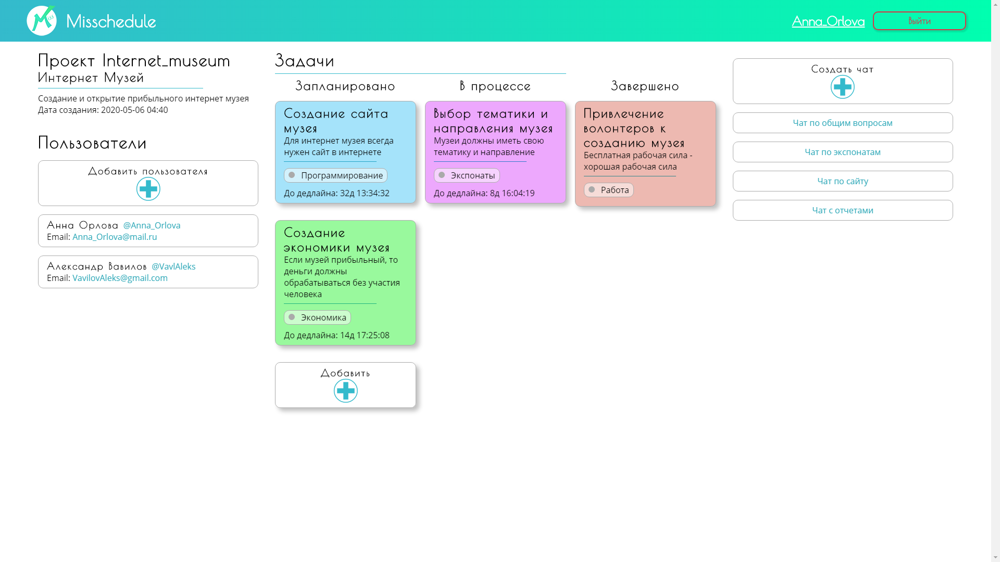

# misschedule
## Creators
Сироткин Семен
Зубарев Филипп
## Idea description
Сегодня нужно многое помнить, чтобы эффективно работать над проетками. ВЫ можете забыть что-то или сделать не 
так как хотели, потому что у вас нет инструмента, который поможет вам помнить и отслеживать ваши проекты в
реальном времени.
## Libraries
 В проекте были использованы такие библиотеки как Flask, Flask-wtf, Flask-login, sqlalchemy, werkzeug и другие
 библиотеки
## Functional
* ### Api
Api реализовано как Flask-приложение в виде микросервисов, которое нужно для получения и обработки
даннх о проектах, пользователях и чатах.
* ### Website
Website - это ещё одно Flask-приложение, которое осуществляет взаимдействие пользователя с Api
через интренет.
* ### Необходимость Api
Api необходим для возможности реализации приложения на нескольких платформах. Можно создать не
только сайт, но и мобильное или desktop приложения на базе текущего Api.

Api протестирован с помощью Postman  

## Relevance
Наш проект значим для общества, так как представляет собой общественно значимую еденицу.
## Screenshots

#  
*Version 1.3*
