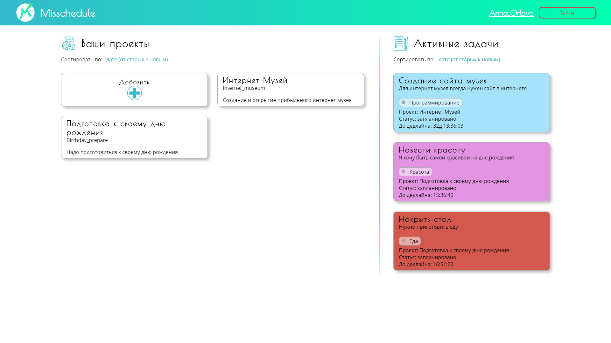

# [Misschedule](http://ec2-18-196-114-33.eu-central-1.compute.amazonaws.com/ 'Перейти на сайт')
## Техническое задание
Создать веб-приложение для управления групповыми проектами и взаимодействия с коллегами. 

## Библиотеки
В проекте были использованы такие библиотеки как Flask, Flask-HTTPAuth, Flask-WTF, Flask-Login,  
Flask-RESTful, sqlalchemy, werkzeug и другие библиотеки, которые можно найти, заглянув в 
requirements.txt.
 
## Работа проекта
* ### Api
Api реализовано как Flask-приложение (находится в директории api) на основе микросервисов, которое 
нужно для получения и обработки данных о проектах, пользователях и чатах. Оно запускается 
на 5000 порту.
* ### Сайт
Сайт - это ещё одно Flask-приложение (находится в директории misschedule), которое осуществляет 
взаимдействие пользователя с Api через браузер. Оно запускается на 8000 порту.
* ### Необходимость Api
Api необходим для возможности реализации приложения на нескольких платформах. Можно создать не
только сайт, но и мобильное приложение, приложение для компьютера и т.д. на базе готового Api.

Api протестирован с помощью Postman  
[](https://app.getpostman.com/run-collection/864c009340669d54c1fa)

## Как запустить сайт у себя на компьютере
* Установите библиотеки, необходимые для работы приложения.  
Находясь в корне проекта, выполните команду в терминале:
    ```
    pip install -r requirements.txt
    ```
* В папке `/api` создайте подпапку `/db`
* Запустите `app_runner.py`
* Запустите `api_runner.py`
* Зайдите на http://localhost:8000
##
Сайт доступен в интернете [по ссылке](http://ec2-18-196-114-33.eu-central-1.compute.amazonaws.com/).
## Screenshots





#  
*Version 1.5.1*
